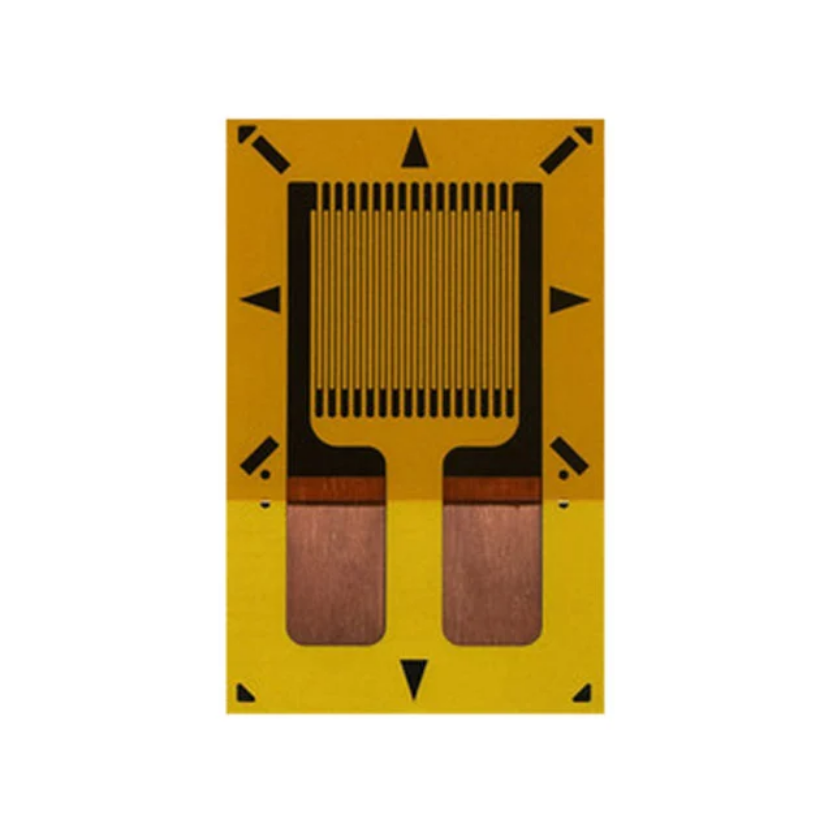

## LiveLine 
**Real-Time Power-Line Fault Monitoring System**
 
**INNOVATE: L3Harris Endowed Summer Program**
 
**Role: Systems Engineering Lead & Team Lead**

<!-- HERO IMAGE: full device/enclosure photo -->

## Overview

Power line failures leaves roughly 34 million households without power and costs the U.S. economy an estimated $150 billion every year, and outages are getting more frequent and lasting longer as the grid ages. While many outages are sudden, such as lightning strikes or large trees falling on a line, many failure modes could be prevented if utility companies had access to live data on the line. When a line does fail, it can cut power to homes and hospitals, disable traffic systems, and in dry conditions, spark a wildfire. Despite this, most power lines still aren't monitored in real time, so developing faults are usually caught only after they've already caused damage. LiveLine is a clamp-mounted sensor system that attaches directly to a power line and tracks it continuously, catching the early mechanical and thermal warning signs of a developing equipment fault before it turns into an outage or a fire.

The sections below distinguish between the **full product vision** and **what has been validated in the current prototype**, since the two are at different stages of maturity.

## System Architecture (Target Design)

LiveLine is designed to fuse five independent sensing modalities into a single clamp-mounted enclosure, each targeting a different fault precursor:

| Sensor | Target Signal | Component | Photo |
|---|---|---|---|
| Strain Gauge | Tension, force, sag, stress, strain | CEA-13-250UWA-350 |  |
| IMU | Vibration, tilt, mechanical fatigue (via Miner's Rule) | QCIOT-ICM42688P |  |
| Temperature Sensor | Line temperature, ambient temperature | DS18B20 |  |
| Acoustic Sensor | Acoustic fault detection | Nano 30 |  |
| Current Sensor | Current detection | SCT-013 |  |

The clamp uses a half-shell hinge design for ease of installation on live lines. The IMU, strain gauge, and acoustic sensor are mounted directly on the clamp body, while the current and temperature sensors are housed within the PLA enclosure.

*Circuit diagram of the sensor electronics. This diagram covers the core sensor wiring; the  strain gauge (mounted on the clamp body) are not pictured.*

## Prototype Validation

The current prototype has validated a subset of this architecture.

### Vibration (IMU)

Verified functional.

**Vibration / IMU demo:**

https://github.com/user-attachments/assets/5e003bab-dd12-4170-9f1b-bec762bf8dd7

 

### Current & Temperature

The current sensor was verified functional, confirmed accurate within a 10% margin in testing against a hot pot load monitored on a watt meter. The temperature sensor was validated in the same test, showing a measurable rise in line temperature that tracked with the increase in current draw.

*Current sensor test setup: hot pot plugged into a watt meter for a known reference reading, compared against the sensor's live output. Line temperature rose in step with current draw, validating the temperature sensor alongside it.*

 

### Acoustics (Nano 30)

Verified functional. Validated using a Hsu-Nielsen pencil break test (a standard method for generating a controlled acoustic emission event), which produced a clear, detectable signal on the oscilloscope. Further characterization of real fault signatures is limited by the sensor's high sensitivity, which is being addressed in the next testing round.

*Oscilloscope output from a Hsu-Nielsen pencil break test, showing a clear signal spike captured by the acoustic sensor.*

 

### Tension

The prototype demonstrated the ability to detect large tension events using a fixed-clamp test setup. This validated the sensing concept but not the final mechanical design, addressed in the next section.

**Tension sensor demo:**

https://github.com/user-attachments/assets/c27b1532-991c-4ed6-aec1-5699cf689674

## Design Iteration: Tension Sensor

The initial prototype validated tension detection using a fixed test clamp, which is not representative of how the sensor will operate in the field. The next design iteration replaces this with a **sliding-clamp mechanism**: one clamp remains fixed while the second slides freely, with a linear potentiometer mounted between the two to directly measure strain along the line as it develops. This removes the fixed-point limitation of the current prototype and is designed to reflect real in-field conditions.

## CAD & Enclosure

The clamp and enclosure were designed in SolidWorks and 3D printed in PLA for prototyping.

 

*CAD design (left) and the printed PLA enclosure (right).*

*Multiple printed prototypes, showing consistency across builds.*

## Live Data Dashboard

The target product includes a live dashboard showing real-time sensor data, current line status, and a predicted failure mode based on sensor readings. The mockup below is running on simulated data to demonstrate the intended interface; it is not yet connected to live sensor output.

*Dashboard mockup showing live data view, line status, and failure mode prediction, running on simulated data.*

## Known Limitations & Next Steps

The current enclosure and clamp are a functional prototype, not a field-ready design, the aluminum clamp is electrically conductive and the enclosure has no Faraday shielding or weatherproofing yet. Planned fixes are detailed in Future Work below.

## Status

LiveLine is an ongoing project. The prototype phase, completed as part of the L3Harris INNOVATE Program, validated core sensing concepts across four of five planned sensor modalities and identified the specific design changes (clamp material, tension mechanism, enclosure protection) needed to move toward a field-deployable version.

## Future Work

- **Sliding-clamp tension sensor** — build and validate the potentiometer-based design described above
- **Non-conductive clamp material** — transition from aluminum to a vibration-transmissive plastic
- **Faraday-shielded, weatherproof enclosure** — move from PLA prototype to a polycarbonate production enclosure
- **Acoustic sensor characterization** — resolve signal-handling limitations to fully validate acoustic fault detection
- **Field validation** of the complete sensor suite against real fault conditions
- **Onboard fault classification** — move from raw sensor logging toward real-time, embedded fault detection

