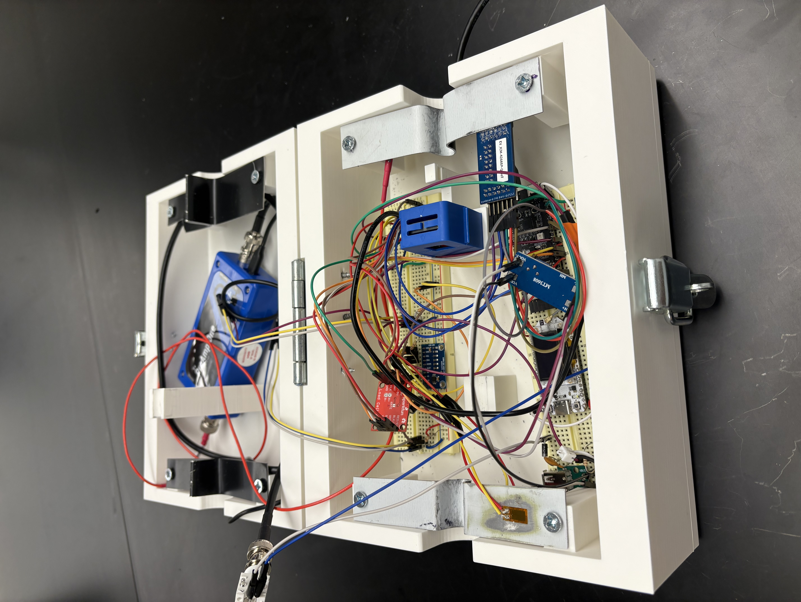

## LiveLine 
**Real-Time Power-Line Fault Monitoring System**
 
**INNOVATE: L3Harris Endowed Summer Program**
 
**Role: Systems Engineering Lead & Team Lead**

<!-- HERO IMAGE: full device/enclosure photo -->
<!--  -->

## Overview

Power line failures cost the U.S. economy an estimated $150 billion a year, and outages are getting more frequent and lasting longer as the grid ages. While many outages are sudden, such as lightning strikes or large trees falling on a line, many failure modes could be prevented if utility companies had access to live data on the line. When a line does fail, it can cut power to homes and hospitals, disable traffic systems, and in dry conditions, spark a wildfire. Despite this, most power lines still aren't monitored in real time, so developing faults are usually caught only after they've already caused damage. LiveLine is a clamp-mounted sensor system that attaches directly to a power line and tracks it continuously, catching the early mechanical and thermal warning signs of a developing equipment fault before it turns into an outage or a fire.

The sections below distinguish between the **full product vision** and **what has been validated in the current prototype**, since the two are at different stages of maturity.

## System Architecture (Target Design)

LiveLine is designed to fuse five independent sensing modalities into a single clamp-mounted enclosure, each targeting a different fault precursor:

| Sensor | Target Signal | Component |
|---|---|---|
| Strain Gauge | Tension, force, sag, stress, strain | CEA-13-250UWA-350 |
| IMU | Vibration, tilt, mechanical fatigue (via Miner's Rule) | QCIOT-ICM42688P |
| Temperature Sensor | Line temperature, ambient temperature | DS18B20 |
| Acoustic Sensor | Acoustic fault detection | Nano 30 |
| Current Sensor | Current detection | SCT-013 |

The clamp uses a half-shell hinge design for ease of installation on live lines, with the IMU, strain gauge, and acoustic sensor mounted directly on the clamp body.

<!-- SYSTEM DIAGRAM: block diagram or annotated internal layout showing sensor placement -->
<!--  -->

## Prototype Validation

The current prototype has validated a subset of this architecture:

- **Current sensor** — verified functional, confirmed accurate within a 10% margin in testing
- **IMU** — verified functional
- **Acoustic sensor (Nano 30)** — verified functional, detecting signal as expected; further characterization is limited by the sensor's high sensitivity, which is being addressed in the next testing round
- **Tension sensing** — the prototype demonstrated the ability to detect large tension events, using a fixed-clamp test setup. This validated the sensing concept but not the final mechanical design (see below)

<!-- DEMO VIDEOS: tension sensor demo, vibration/IMU demo -->
<!-- Tension sensor demo: [link or embed] -->
<!-- Vibration / IMU demo: [link or embed] -->

## Design Iteration: Tension Sensor

The initial prototype validated tension detection using a fixed test clamp, which is not representative of how the sensor will operate in the field. The next design iteration replaces this with a **sliding-clamp mechanism**: one clamp remains fixed while the second slides freely, with a linear potentiometer mounted between the two to directly measure strain along the line as it develops. This removes the fixed-point limitation of the current prototype and is designed to reflect real in-field conditions.

<!-- CAD RENDERING: updated tension sensor design (fixed + sliding clamp with potentiometer) -->
<!--  -->

## Known Limitations & Next Steps

The current enclosure and clamp are a functional prototype, not a field-ready design. Two items are the immediate focus of the next iteration:

- **Material:** The current clamp is aluminum, which is electrically conductive and unsuitable for a device mounted on an energized line. The next revision moves to a plastic material selected to still transmit vibration accurately to the IMU and acoustic sensor.
- **Enclosure protection:** The current prototype has no Faraday shielding or weatherproofing. The planned production enclosure uses polycarbonate for weather resistance, with Faraday shielding added to protect sensor electronics from electromagnetic interference near energized lines.

<!-- CAD / ENCLOSURE IMAGES -->
<!--   -->

## Status

LiveLine is an ongoing project. The prototype phase, completed as part of the L3Harris INNOVATE Program, validated core sensing concepts across four of five planned sensor modalities and identified the specific design changes (clamp material, tension mechanism, enclosure protection) needed to move toward a field-deployable version.

## Future Work

- **Sliding-clamp tension sensor** — build and validate the potentiometer-based design described above
- **Non-conductive clamp material** — transition from aluminum to a vibration-transmissive plastic
- **Faraday-shielded, weatherproof enclosure** — move from PLA prototype to a polycarbonate production enclosure
- **Acoustic sensor characterization** — resolve signal-handling limitations to fully validate acoustic fault detection
- **Field validation** of the complete sensor suite against real fault conditions
- **Onboard fault classification** — move from raw sensor logging toward real-time, embedded fault detection

